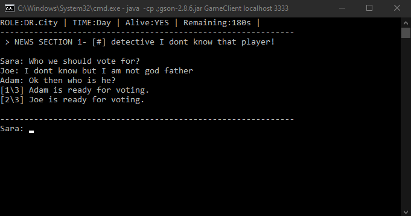
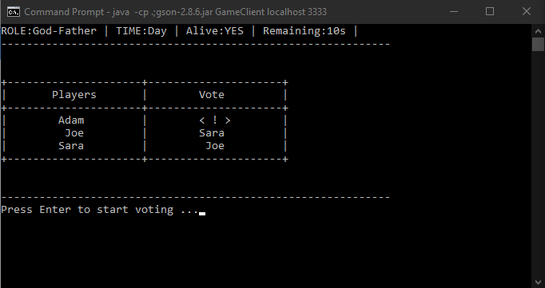
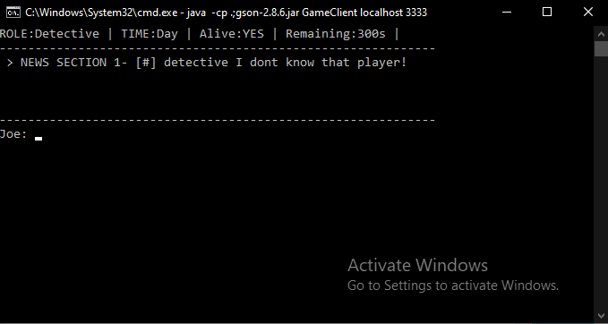
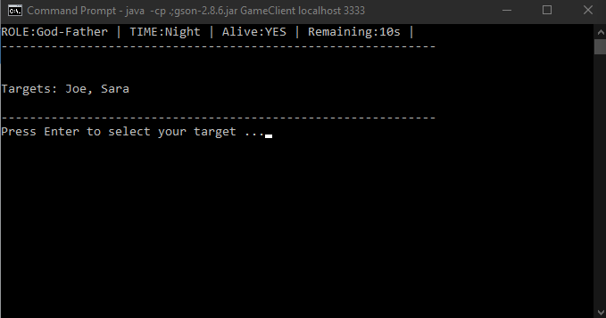

# Mafia Console Game

## Some screen shots of the game

### Chat room during day

### Voting process

### News section

### God father role

## Server Side

### Compile server side code

> javac -cp .;gson-2.8.6.jar Main.java

> javac -cp .;gson-2.8.6.jar GameServer.java

### Run server side code

#### Bellow command will start `4` game servers on ports `2222,3333,4444,5555` that clients can connect.

> java -cp .;gson-2.8.6.jar Main

#### Bellow command will lauch only `1` server on port `3333` that clients can connect.

> java -cp .;gson-2.8.6.jar GameServer 33333

## Client Side

### Compile client side code

> javac -cp .;gson-2.8.6.jar GameClient.java

### Run client side code

> java -cp .;gson-2.8.6.jar GameClient localhost 3333

## Compile in VsCode

#### to compile in VsCode press `ctrl+p` then type bellow command

 

> task build client
